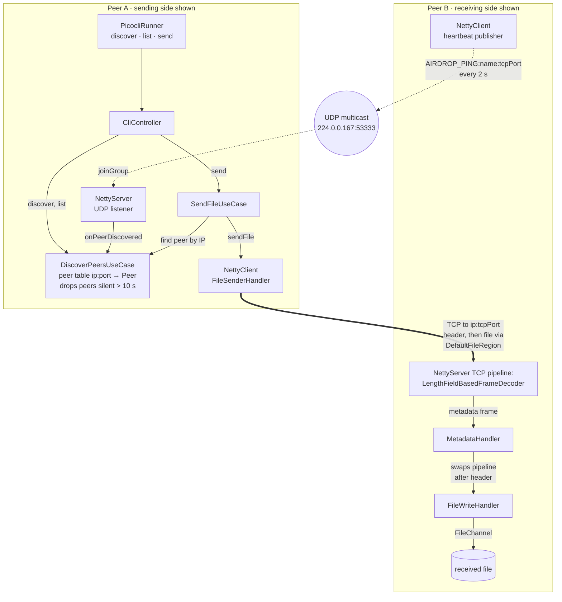
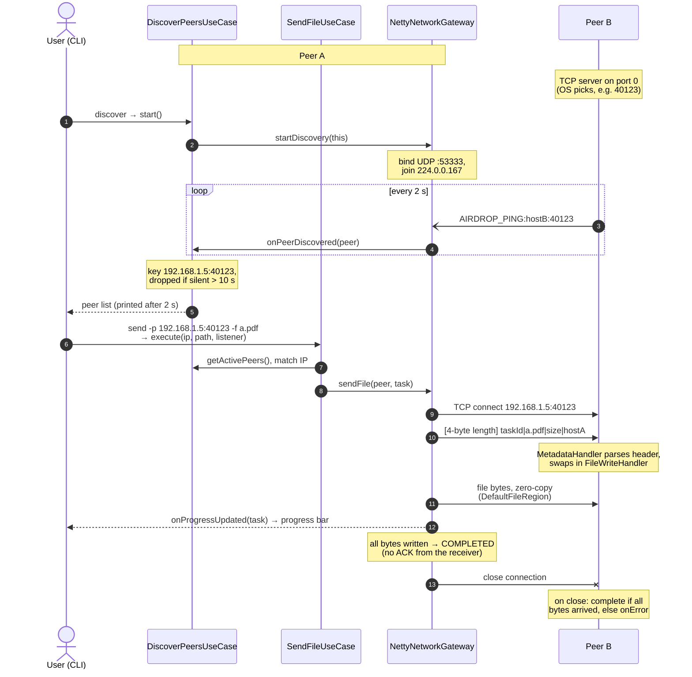

# LAN P2P File Transfer

A zero-configuration, peer-to-peer file transfer tool for local networks, in the spirit of AirDrop. Peers find each other automatically over UDP multicast and exchange files directly over TCP. There is no central server and no manual IP entry.

Built in Java 17 with [Netty](https://netty.io/) for asynchronous networking and [Picocli](https://picocli.info/) for the command-line interface. The code follows Clean Architecture. This was the final project for a Software Engineering course at National Cheng Kung University (NCKU).

---

## Features

- **Automatic peer discovery.** Every node multicasts a heartbeat every 2 seconds. Peers that stay silent for more than 10 seconds are evicted from the active list.
- **Direct TCP transfer with zero-copy I/O.** The sender streams the file with Netty's `DefaultFileRegion`, so on supported platforms the kernel moves the bytes straight from the file to the socket, without copying them into user space.
- **Progress reporting on both ends.** The sender and the receiver both report live transfer progress.
- **Two ways to run.** An interactive shell keeps the node online so others can discover it and send to it. A one-shot mode runs a single command and exits.
- **No configuration.** The TCP port is assigned by the operating system and advertised in the heartbeat, so nothing needs to be set up by hand.

A Windows desktop build with a Swing GUI is published as the [v1.0.0 release](https://github.com/Adam010341/decentralized-file-transfer/releases/tag/v1.0.0). It adds a graphical peer picker, progress bars and automatic zipping of folders. The GUI source lives on the `feat/DesktopApp` branch; `main` contains the command-line application described below.

## How It Works

Every node runs both halves of the protocol. At startup it opens a TCP server on an OS-assigned port and begins multicasting a heartbeat that advertises that port. When you run `discover`, it also joins the multicast group and starts filling its in-memory peer table. The diagram below shows the parts involved when Peer A sends a file to Peer B. Peer A also sends heartbeats, and Peer B can discover peers in the same way, but those parts are left out. Dotted arrows are UDP discovery traffic and the thick arrow is the TCP transfer.



The sequence below follows one transfer from start to finish: discovery, choosing a peer from the list, the metadata header, the zero-copy file stream, and how each side decides that the transfer is finished. The IP address and port are example values. Byte-level formats are in [Wire Protocol](#wire-protocol), and the layer rules are in [Architecture](#architecture).



## Getting Started

### Prerequisites

- JDK 17 or later
- Two or more machines on the same LAN, with UDP multicast allowed by the network and the local firewall

The Maven wrapper is included, so a separate Maven installation is not required.

### Build

```bash
./mvnw package -DskipTests
```

This produces a self-contained executable jar at `target/p2p-file-transfer-1.0-SNAPSHOT.jar`.

### Run

Start the interactive shell on each machine:

```bash
java -jar target/p2p-file-transfer-1.0-SNAPSHOT.jar
```

The node starts its TCP server, begins advertising itself, and then waits for commands at the `airdrop>` prompt:

| Command | Description |
|---|---|
| `discover` | Listen for peers on the local network via UDP multicast. |
| `list` | Show the peers currently known to be active, with their `ip:port` IDs. |
| `send -p <ip:port> -f <path>` | Send a file to a discovered peer. Quote paths that contain spaces. |
| `exit` / `quit` | Shut the node down. |

A typical session looks like this:

```text
airdrop> discover
airdrop> list
airdrop> send -p 192.168.1.5:40123 -f "./report.pdf"
```

A peer must have been discovered in the current session before a file can be sent to it. Received files are saved to the receiver's working directory as `downloaded_<file name>`. Console messages are in Traditional Chinese.

Each subcommand can also be run on its own, for example `java -jar … --help`. Because the peer list lives in memory, `send` is intended for the interactive shell.

## Architecture

The code is organized into Clean Architecture layers, and dependencies point only inward. The core business logic knows nothing about Netty, Picocli or the terminal. It talks to the outside world only through port interfaces, which the outer layers implement.

| Layer | Package | Responsibility |
|---|---|---|
| Entities | `domain.model` | `Peer` and `FileTask`, the core data and state, with no external dependencies. |
| Use cases | `usecase` | `DiscoverPeersUseCase` keeps the registry of active peers and evicts stale ones. `SendFileUseCase` validates the target and coordinates a transfer. |
| Ports | `usecase.port.in` / `usecase.port.out` | `PeerDiscoveryListener` and `FileTransferListener` are callbacks into the core. `NetworkGateway` is the core's abstraction of the network. |
| Interface adapters | `adapter.controller` | `CliController` translates user commands into use-case calls and renders the results. |
| Frameworks & drivers | `infrastructure.netty`, `infrastructure.cli` | `NettyNetworkGateway`, `NettyServer` and `NettyClient` implement `NetworkGateway` on top of Netty. `PicocliRunner` defines the command-line interface. |
| Composition root | `App` | Wires the concrete implementations together (manual dependency injection) and starts the shell. |

Both the controller and CLI test suites include architecture-guard tests that enforce these boundaries. A sequence diagram of the send flow is in [`docs/architecture/file-transfer-sequence.md`](docs/architecture/file-transfer-sequence.md).

## Wire Protocol

**Discovery (UDP).** Every node sends a heartbeat to the multicast group `224.0.0.167:53333` every 2 seconds:

```text
AIRDROP_PING:<node name>:<tcp port>
```

The receiver takes the peer's IP address from the datagram's source address. The node name is the machine's hostname.

**Transfer (TCP).** The sender opens a connection to the peer's advertised port and writes:

1. A metadata frame: a 4-byte big-endian length, followed by the UTF-8 string `<task id>|<file name>|<file size>|<sender name>`.
2. The raw file contents, streamed with zero-copy I/O.

The sender closes the connection when the file has been sent. The receiver treats the transfer as complete if it has received the declared number of bytes when the connection closes, and as failed otherwise.

## Testing

```bash
./mvnw test
```

The suite contains 77 JUnit 5 and Mockito tests. It covers the use cases, the controller and the CLI (including the architecture guards), the Netty layer, and end-to-end transfers between two in-process nodes. The discovery and end-to-end tests send real multicast traffic, so they depend on the host's network configuration (see [Known Limitations](#known-limitations)).

## Known Limitations

- **Trusted networks only.** Peers are not authenticated and transfers are not encrypted.
- **Received file names are used as sent.** The receiver does not yet sanitize the incoming file name before writing to disk.
- **Interface selection.** Discovery binds to the first active, multicast-capable IPv4 interface. On hosts that also have VPN or container interfaces (such as Tailscale or Docker bridges), that may not be the LAN interface, and peers will not be found.
- **One file per transfer, sent over a single stream.** Transfers cannot be resumed and are not verified with a checksum.

## Future Work

- Parallel, chunked transfer over multiple connections
- Resumable transfers with end-to-end integrity checks
- Peer authentication and encrypted transport
- Explicit network interface selection
- Merging the desktop GUI into `main`

## Development Process

The team worked on feature branches, and by convention every change reached `dev` and `main` through a pull request reviewed by another member. Reviews focused on keeping the architectural boundaries intact; for example, the UI layer must never call Netty directly. The team also used AI coding assistants. By team convention, every AI-assisted pull request records the prompts and technical requirements it was built from, so each change stays traceable and reviewable.

## Contributors

- [@Adam010341](https://github.com/Adam010341)
- [@f74131526](https://github.com/f74131526)
- [@changoscarx](https://github.com/changoscarx)

## License

Released under the [MIT License](LICENSE).
