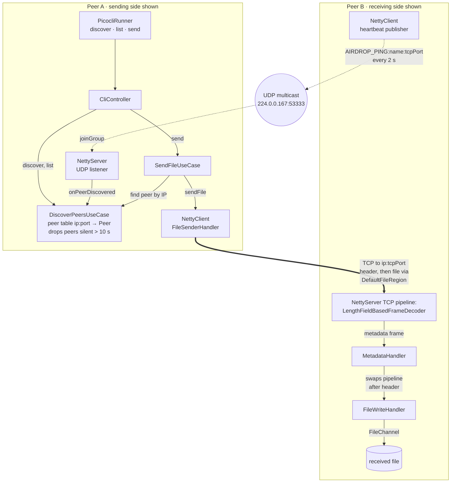

# LAN P2P File Transfer


A zero-configuration peer-to-peer file transfer tool for local networks, in the spirit of AirDrop. Peers find each other over UDP multicast and send files directly over TCP. There is no central server. You pick the receiver from the discovered peers.

Written in Java 17 with [Netty](https://netty.io/) and [Picocli](https://picocli.info/). Final project for a Software Engineering course at National Cheng Kung University (NCKU).

## Features

- Peer discovery: every node multicasts a heartbeat every 2 seconds. Peers silent for more than 10 seconds are dropped at the next check (every 5 seconds).
- Zero-copy transfer with Netty's `DefaultFileRegion`. On supported platforms the kernel moves bytes from file to socket directly.
- Progress shown on both sender and receiver.
- Interactive shell, or a one-shot mode that runs one command and exits.
- No configuration. The OS assigns the TCP port and the heartbeat advertises it.

A Windows desktop build with a Swing GUI is published as the [v1.0.0 release](https://github.com/Adam010341/decentralized-file-transfer/releases/tag/v1.0.0). The GUI source is on the `feat/DesktopApp` branch; `main` has the command-line application.

## How It Works

Each node runs a TCP server on an OS-assigned port and multicasts a heartbeat with that port. `discover` joins the multicast group and fills an in-memory peer table. Below, Peer A sends a file to Peer B. Dotted arrows are UDP, the thick arrow is TCP.


```mermaid
flowchart TB
    subgraph B["Peer B · receiving side shown"]
        PUB["NettyClient<br/>heartbeat publisher"]
        DEC["NettyServer TCP pipeline:<br/>LengthFieldBasedFrameDecoder"]
        META["MetadataHandler"]
        WRITE["FileWriteHandler"]
        DISK[("received file")]
        DEC -->|"metadata frame"| META
        META -->|"swaps pipeline<br/>after header"| WRITE
        WRITE -->|"FileChannel"| DISK
    end

    MC(("UDP multicast<br/>224.0.0.167:53333"))

    subgraph A["Peer A · sending side shown"]
        CLI["PicocliRunner<br/>discover · list · send"]
        CTRL["CliController"]
        UDPL["NettyServer<br/>UDP listener"]
        REG["DiscoverPeersUseCase<br/>peer table ip:port → Peer<br/>drops peers silent > 10 s"]
        SEND["SendFileUseCase"]
        SENDER["NettyClient<br/>FileSenderHandler"]
        CLI --> CTRL
        CTRL -->|"discover, list"| REG
        CTRL -->|"send"| SEND
        UDPL -->|"onPeerDiscovered"| REG
        SEND -->|"find peer by IP"| REG
        SEND -->|"sendFile"| SENDER
    end

    PUB -.->|"AIRDROP_PING:name:tcpPort<br/>every 2 s"| MC
    MC -.->|"joinGroup"| UDPL
    SENDER ==>|"TCP to ip:tcpPort<br/>header, then file via<br/>DefaultFileRegion"| DEC
```

Byte formats are under Wire Protocol. A sequence diagram of the send flow with error paths is in [`docs/architecture/file-transfer-sequence.md`](docs/architecture/file-transfer-sequence.md).

## Getting Started

Requires JDK 17+ and two or more machines on the same LAN with UDP multicast allowed. The Maven wrapper is included.

```bash
./mvnw package -DskipTests
java -jar target/p2p-file-transfer-1.0-SNAPSHOT.jar
```

The node starts its TCP server and heartbeat, then waits at the `airdrop>` prompt:

| Command | Description |
|---|---|
| `discover` | Listen for peers via UDP multicast. |
| `list` | Show active peers with their `ip:port` IDs. |
| `send -p <ip:port> -f <path>` | Send a file to a discovered peer. The peer is looked up by IP only; the file goes to the port from its heartbeat. Quote paths with spaces. |
| `exit` / `quit` | Shut the node down. |

```text
airdrop> discover
airdrop> list
airdrop> send -p 192.168.1.5:40123 -f "./report.pdf"
```

A peer must be discovered in the current session before you can send to it. Received files are saved to the working directory as `downloaded_<file name>`. Console messages are in Traditional Chinese; `--help` is in English.

Passing a command as arguments runs it once and exits (`java -jar ... --help`). Since the peer list is in memory and filled only by `discover`, `send` works only in the interactive shell.

## Architecture

Clean Architecture layers, dependencies pointing inward. The core has no Netty, Picocli or terminal code and talks to the outside through port interfaces.

| Layer | Package | Responsibility |
|---|---|---|
| Entities | `domain.model` | `Peer`, `FileTask` |
| Use cases | `usecase` | `DiscoverPeersUseCase` (active-peer registry, eviction), `SendFileUseCase` (validates and coordinates a transfer) |
| Ports | `usecase.port.in` / `usecase.port.out` | `PeerDiscoveryListener`, `FileTransferListener`, `NetworkGateway` |
| Adapters | `adapter.controller` | `CliController` turns commands into use-case calls |
| Infrastructure | `infrastructure.netty`, `infrastructure.cli` | `NettyNetworkGateway` (over `NettyServer` and `NettyClient`), `PicocliRunner` |
| Composition root | `App` | Manual dependency injection, starts the server and heartbeat, runs the shell |

Reflection-based tests check these boundaries.

## Wire Protocol

Discovery (UDP): every 2 seconds each node sends to `224.0.0.167:53333`:

```text
AIRDROP_PING:<node name>:<tcp port>
```

The peer's IP comes from the datagram source address. The node name is the hostname.

Transfer (TCP): the sender connects to the advertised port and writes:

1. A metadata frame: 4-byte big-endian length, then the UTF-8 string `<task id>|<file name>|<file size>|<sender name>`.
2. The raw file contents, zero-copy.

The sender then closes the connection. If the receiver has the declared number of bytes by then, the transfer is complete. Otherwise it failed.

## Testing

```bash
./mvnw test
```

80 JUnit 5 and Mockito tests: discovery and eviction, controller, CLI, the Netty layer, and an end-to-end transfer between two in-process nodes. The three discovery tests send real multicast traffic and can fail on hosts hit by the interface limitation below.

## Known Limitations

- Trusted networks only: no peer authentication or encryption.
- The receiver does not sanitize incoming file names and overwrites an existing `downloaded_<file name>`.
- Interface selection: the listener joins on the first active, multicast-capable, non-loopback IPv4 interface Java reports. With Tailscale or Docker bridges present it may pick one of those and find no peers.
- One node per IP: `send` picks the target by IP only.
- One file per transfer over a single stream; no resume and no checksum.

## Future Work

Parallel chunked transfer, resumable transfers with integrity checks, peer authentication and encryption, explicit interface selection, merging the desktop GUI into `main`.

## Contributors

The team used feature branches, and every change reached `dev` and `main` through a pull request reviewed by another member. The team also used AI coding assistants; by convention, each AI-assisted pull request records the prompts and requirements it was built from.

- [@Adam010341](https://github.com/Adam010341)
- [@f74131526](https://github.com/f74131526)
- [@changoscarx](https://github.com/changoscarx)

Licensed under the [MIT License](LICENSE).
