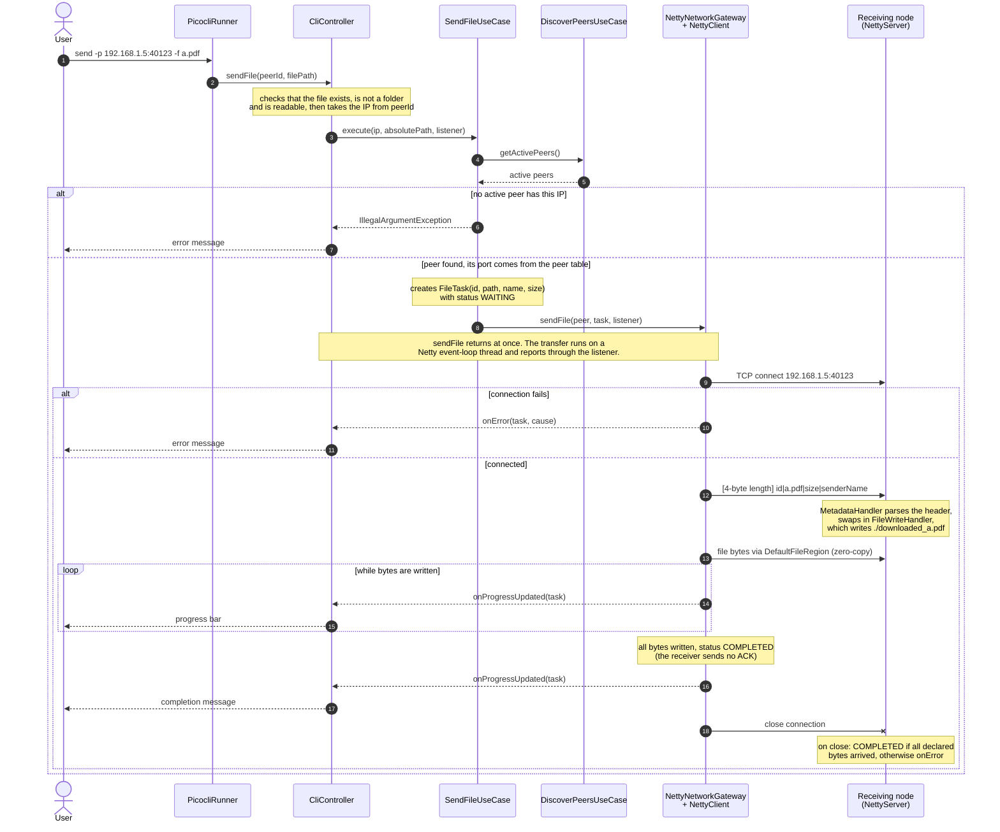

# Send Flow

This diagram follows one `send` command through the layers, from the CLI on the sending node to the file on the receiving node's disk. It adds the validation and error paths that the overview in the [README](../../README.md#how-it-works) leaves out. The IP address, port and file name are example values, and the peer is assumed to have been found by an earlier `discover`.

`CliController` only checks the peer ID's `ip:port` shape; `SendFileUseCase` matches the IP address against the active peers, so the port typed in the ID is not used. `SendFileUseCase` also checks the file again before it creates the `FileTask`. On the receiving node, `App` registers the `FileTransferListener` that prints receive progress and, once the task is `COMPLETED`, the path of the saved file.
